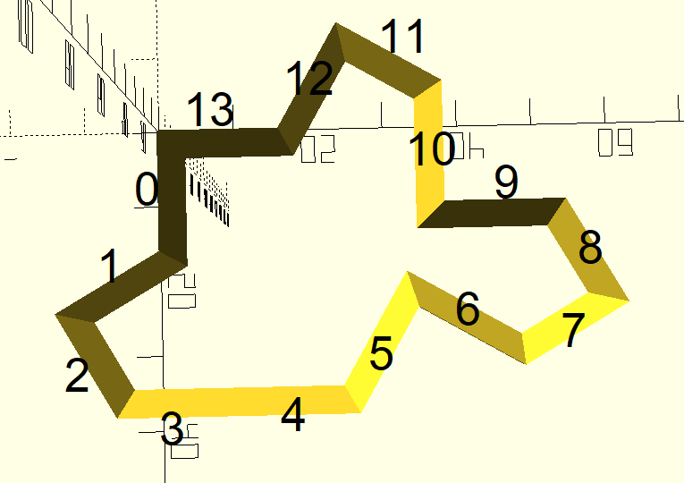
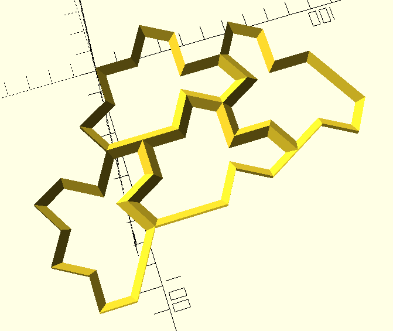

# Spectrefinity

Gridfinity meets the Spectre tile.

## Usage

3 files ar available: `tile.scad`, `bucket.scad`, `clip.scad`

### Base - `tile.scad`

The file is used for building the base for bins. Base consists of several tiles oriented based on tile edges connection.



*Important:* long edge between edges 2 and 5 is considered two edges with angle of 180 deg. This way the code is simpler, and all the edges are of the same length.

The file has a `build_tree` parameter, which specifies how do you want to build your base. The rules are:
- the `build_tree` is an array of arrays of 3 numbers - index of a tile to connect to, index of an edge to connect to (parent tile edge), index of an edge to connect (child tile edge),
- there's always a starting tile with index 0,
- all previous steps are instantly accessible.

So, e.g., 

```
[
    [0, 3, 8],
    [0, 4, 13],
    [2, 10, 11]
]
```

means:
- create a child tile connected to 0th tile's 3rd edge with child's 8th edge, - this will be a tile # 1,
- create a child tile connected to 0th tile's 4th edge with child's 13th edge, - this will be a tile # 2,
- create a child tile connected to 2nd tile's 10th edge with child's 11th edge, - this will be a tile # 3.



### Bin - `bucket.scad`

For now, bin geometry is quite simplistic - it only has a relief to stand on the tiles, and a little inbound rim.

The building logic is the same as for the tile - you have a `build_tree` parameter.

There's also a `preview` parameter that shows the base corresponding to the build tree you entered - allowing you to check the bin will fit the place intended. Due to aperiodic nature of the tiling using the Spectre tile, this might be helpful - the bin will fit one place only!

NB: I heard it's possible to make a periodic tiling using the Spectre, but as I understand this version of the tile doesn't allow such.

### Clip - `clip.scad`

WIP. A really simple part to connect the tiles. This might be useful if you:
- print single tiles, 
- print sets of tiles that shall be connected later.